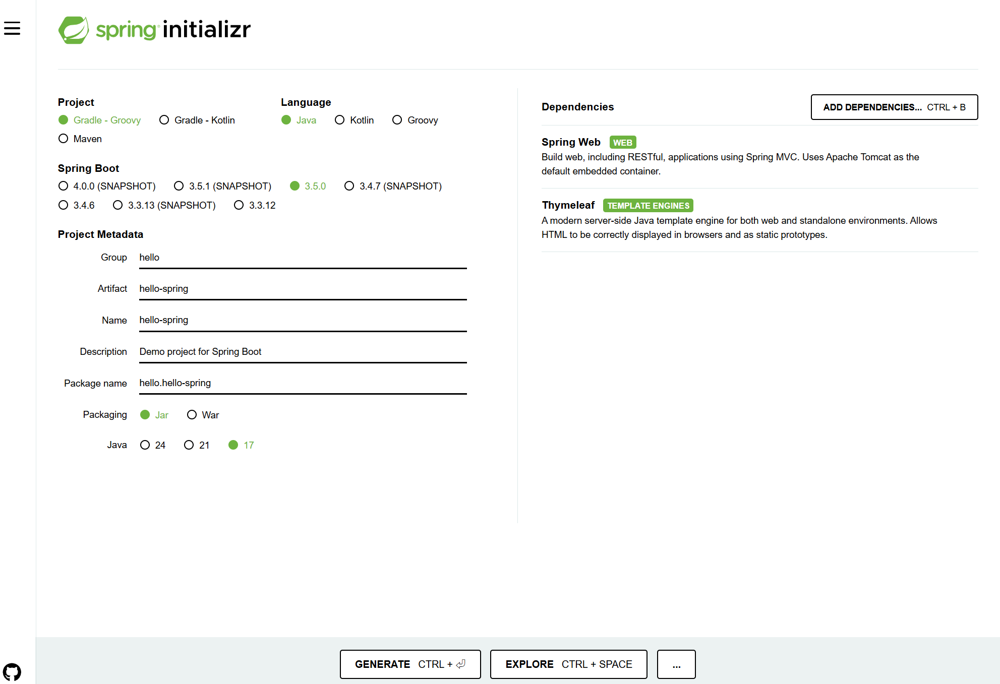
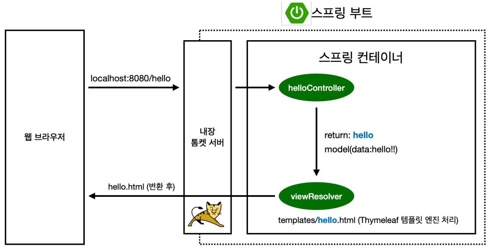
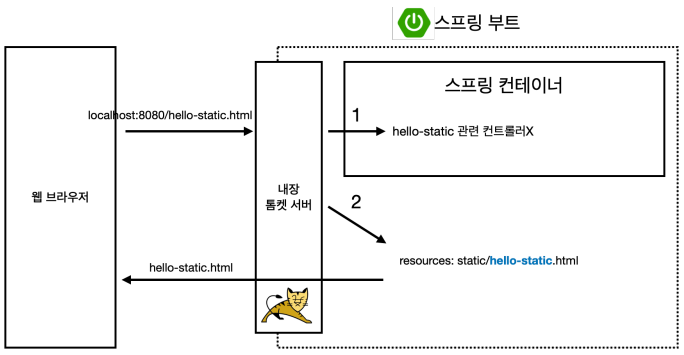
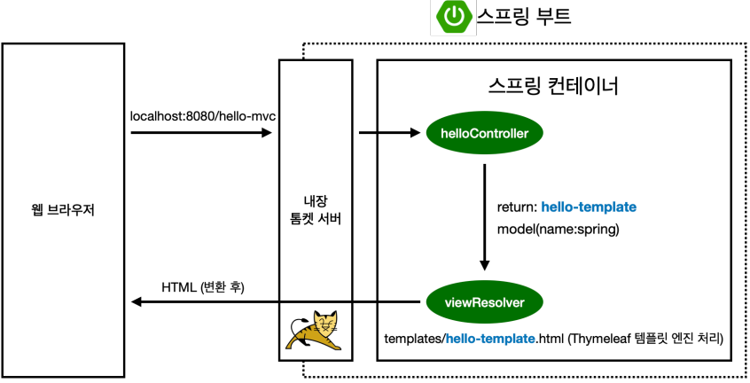
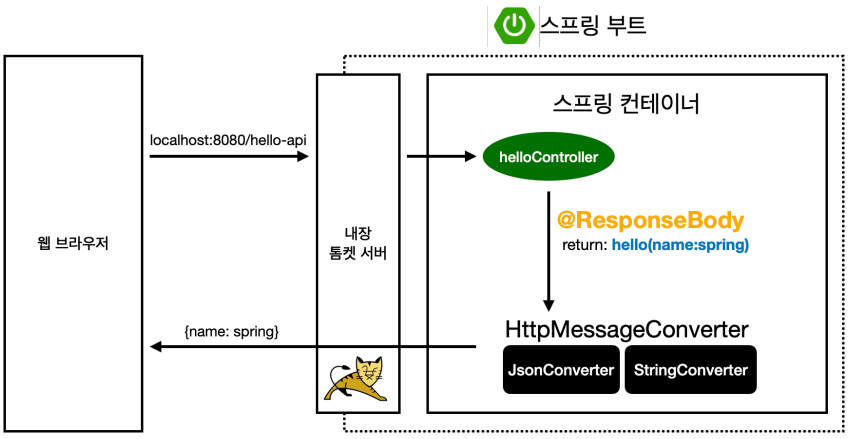
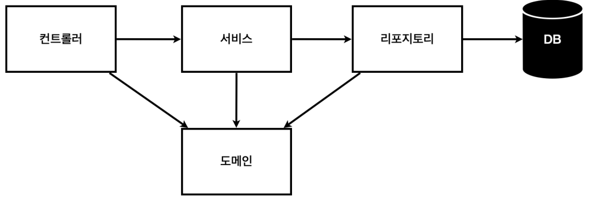
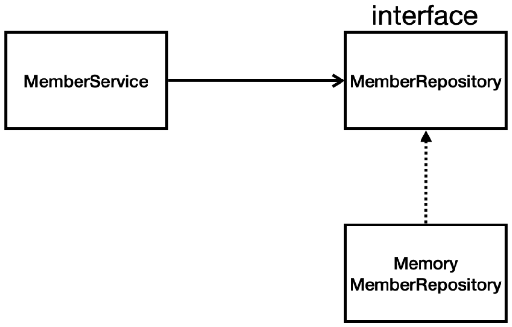
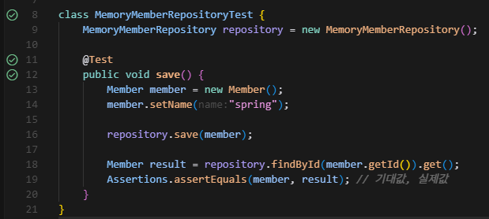
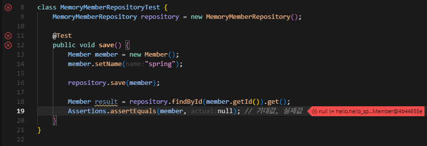

*Rpm Study (for the Spring and Spring boot) - RPM 서비스 기획팀 BE 개발자들의 스터디 공간입니다.*

## 학습 정보
추후 합류하게 될 Motiiv BE 업무 대비, spring 및 spring boot를 익힌다.
### 학습 목표
- inflearn 강의를 듣고 공유한다.

### 학습 진행 방법
#### 진행 규칙
- 각자 맡은 예제 프로젝트 완성 후 오프라인에서 설명&질문 타임
	- 섹션 3: 상준 / 섹션 4: 태이/ 섹션 5: 정빈
	- 자기가 맡은 부분이 별 게 없어서 다른 사람 영역까지 하면 완전 멋쟁이!
- 6월 17일, 6월 24일, 7월 2일. 세 번의 오프라인 스터디를 진행한다.

#### 강의 링크
[스프링 입문 - 코드로 배우는 스프링 부트, 웹 MVC, DB 접근 기술 (inflearn/김영한)](https://www.inflearn.com/course/%EC%8A%A4%ED%94%84%EB%A7%81-%EC%9E%85%EB%AC%B8-%EC%8A%A4%ED%94%84%EB%A7%81%EB%B6%80%ED%8A%B8/dashboard)
> inflearn은 동시 접속 불가 (동시 접속 다회 발생 시 제한 발생)

## 개발 환경 소개
### 예제 생성
[spring initializr](https://start.spring.io/) 에서 프로젝트를 생성한다.

- Project: Gradle - Groovy
- Language: Java
- Spring Boot: 3.5.0
- *Project Mateadata (변경 가능)*
	- *Group: hello*
	- *Atifact: hello-spring*
	- *Name: hello-spring*
	- *Description: Demo project for Spring Boot*
	- *Package name: hello.hello-spring*
- Java: 17
- Dependencies: Spring Web, Thymeleaf

### 예제 관련 설명
- Motiiv 에서는 **Gradle + Kotlin언어** 조합의 spring boot 환경을 사용 중
- 다만 강의의 내용은 **Gradle + Grooby + Java언어** 이기 때문에 일단은 강의대로 따라간다.
- 실제 Java와 Kotlin은 문법 차이가 크지 않기 때문에, 최우선적으로 spring boot를 이해하는 것을 주 목적으로 하고 추후 Kotiln은 적응하는 것으로 한다.

---
---

# 00. Spring vs Spring Boot
### spring Framework (기반 프레임워크)
- **Spring**은 Java 기반의 **기업용 애플리케이션 개발 프레임워크**
- 핵심 철학은 **"의존성 주입(DI)"**과 **"관심사의 분리(SoC)"**.
- 모듈식 구성:
    - Spring Core (DI, Bean)
    - Spring MVC (웹 개발)
    - Spring Data (DB 접근)
    - Spring Security (보안)
    - Spring AOP, etc.

> **기능은 강력하지만 설정이 매우 복잡하고 방대한 XML이나 자바 설정이 요구됨.**

### Spring Boot (Spring의 생산성 도구)
- **Spring Boot는 Spring Framework를 더 쉽게 사용하기 위한 도구**
- "Spring을 쓰고 싶은데 너무 어렵다"는 문제를 해결하기 위해 등장
- 주요 특징:    
    - 자동 설정(Auto Configuration)
    - 내장 톰캣 서버 제공 (외부 톰캣 설치 불필요)
    - 최소 설정으로 실행 가능한 독립형 앱 가능
    - `application.yml` 또는 `application.properties` 기반 설정
    - `starter` 패키지로 의존성 관리 단순화

> **Spring Boot는 Spring을 더 쉽게, 더 빠르게 쓰기 위한 도구이며 Spring 위에서 동작**

### 결론
- **Spring Boot는 Spring Framework 위에 구축된 "생산성 도구"이며, Spring 없이 Spring Boot는 존재할 수 없다.
- Spring Boot는 Spring의 복잡한 설정을 자동화해 개발을 훨씬 더 빠르고 쉽게 만들어주는 역할

# 01. 프로젝트 생성과 환경
## 1-1. 프로젝트 생성
spring boot 프로젝트 생성은 [spring initializr](https://start.spring.io/) 에서 하는 것이 일반적이다.
여기에서 기본적인 환경과 의존성을 세팅하면 필요 파일을 자동으로 생성해 준다.

위와 같이 선택.
- Project와 Language 조합이 있다.
	- Gradle-Groovy + Java : 과거부터 많이 쓰던 형태
	- Gradle-Kotlin + Kotlin
- spring boot 버전은 최신을 고르면 된다. 단 (SNAPSHOT) 붙은 건 아직 안정화 전 버전
## 1-2. 라이브러리
### 의존 관계
##### build.gradle
- 의존 관계 확인 : dependencies 를 보면 사용하는 library 목록 있음
##### gradle projects
를 까보면 참조하는 라이브러리들의 의존성을 확인할 수 있음.
예전엔 하나하나 다 웹 서버에 깔아 놓고 코드를 밀어 넣었지만, 요즘엔 embedded 방식이라 코드에 포함되어 바로 실행된다.

### 스프링 부트 라이브러리
- spring-boot-starter-web
	- spring-boot-starter-tomcat: 톰캣(웹서버)
	- spring-webmvc: 스프링 웹 MVC
- spring-boot-starter-thymeleaf: 타임리프 템플릿 엔진(View)
- spring-boot-starter(공통): 스프링 부트 + 스프링 코어 + 로깅
	- spring-boot
		- spring-core
	- spring-boot-starter-logging
		- logback, slf4j
## 테스트 라이브러리
- spring-boot-starter-test
	- junit: 테스트 프레임워크
	- mockito: 목 라이브러리
	- assertj: 테스트 코드를 좀 더 편하게 작성하게 도와주는 라이브러리
	- spring-test: 스프링 통합 테스트 지원
## 1-2. 환경 설정
### View 환경 설정
#### Welcom Page 만들기
- `/src/main/resources/static/` 하위에 `index.html` 파일을 만들면 Home 화면을 만들 수 있다.
- 스프링부트가 이 경로의 index.html을 최우선으로 찾아 보여준다.
#### thymeleaf 템플릿 엔진

- 컨트롤러에서 리턴 값으로 문자를 반환하면 뷰 리졸버(`viewResolver`)가 화면을 찾아서 처리한다.
	- 스프링 부트 템플릿엔진 기본 viewName 매핑
	- `resources:templates/`+{ViewName}+`.html`
> 참고: `spring-boot-devtools`라이브러리를 추가하면, `html`파일을 컴파일만 해도 서버 재시작 없이 View 파일 변경이 가능

# 02. 스프링 웹 개발 기초
## 2-0. 웹 컨텐츠의 방식
##### 1. 정적 컨텐츠
파일을 그대로 내려 주는 것. 내용이 바뀌지 않음
##### 2. MVC와 템플릿 엔진
서버에서 프로그래밍을 거쳐 동적인 내용을 표시
##### 3. API
서버 간 통신 내용

## 2-1. 정적 컨텐츠

스프링 컨테이너가 우선순위를 가진다. 여기에 컨트롤러가 없으면 파일을 찾아서 표시해준다.

## 2-2. MVC와 템플릿 엔진
MVC = Model, View, Controller
##### Controller

- controller에 정의된 함수가 return 한 값으로 template을  찾는다.
- 함수 return값과 templates의 파일명이 일치해야 함

## 2-3. API

##### `@ResponseBody` 사용
- HTTP의 body에 문자 내용을 직접 반환
- `viewResolver` 대신에 `HttpMessageConverter`가 동작
- 기본 문자처리: StringHttpMessageConverter
- 기본 객체처리: MappingJackson2HttpMessageConverter
- byte 처리 등등 기타 여러 HttpMessageConverter가 기본으로 등록되어 있음

> 참고 : 클라이언트의 HTTP Accept 헤더와 서버의 컨트롤러 반환 타입 정보 둘을 조합해서 `HttpMessageConverter`가 선택된다.

## 기타
#### Spring 어노테이션(Annotation)
- `@Controller`
	- 컨트롤러 클래스 표시
- `@Service`
	- 서비스 클래스 표시
- `@Repository`
	- 리포지토리 클래스 표시
- `@Component`
	- 스프링 빈으로 등록
- `@Autowired`
	- 의존성 주입
- `@GetMapping`, `@PostMapping`
	- HTTP 메서드 매핑

# 03. 회원관리 예제
## 3-1. 예제 비즈니스 요구 사항 정리
- 데이터: 회원ID, 이름
- 기능: 회원 드록, 조회
- 아직 데이터 저장소가 선정되지 않음(가상 시나리오)
#### 일반적인 웹 애플리케이션 계층 구조

- 컨트롤러: 웹 MVC의 컨트롤러 역할
- 서비스: 핵심 비즈니스 로직 구현
- 리포지토리: 데이터베이스에 접근, 도메인 객체를 DB에 저장하고 관리
- 도메인: 비즈니스 도메인 객체
  예) 회원, 주문, 쿠폰 등 주로 데이터베이스에 저장하고 관리

##### 예제 클래스 의존관계

- 아직 데이터 저장소가 선정되지 않아서, 우선 인터페이스로 구현 클래스를 변경할 수 있도록 설계
- 데이터 저장소는 RDB, NoSQL 등등 다양한 저장소를 고민 중인 상황으로 가정
- 개발을 진행하기 위해서 초기 개발 단계에서는 구현체로 가벼운 메모리 기반의 데이터 저장소 사용

## 3-2. 예제 테스트 케이스 코드 작성
##### 전통적인? 방식
- 개발한 기능을 실행해서 테스트 하기 위해서는 main 메서드를 실행하거나 웹 애플리케이션의 컨트롤러를 통해 해당 기능을 실행
- 준비하고 실행하는데 오래 걸리고, 반복 실행하기 어렵고 여러 테스트를 한번에 실행하기 어렵다
### JUnit
테스트를 위한 프레임워크이다.
#### JUnit으로 테스트 작성하기
- 작성 위치: 테스트할 대상과 root만 다르고 하위는 동일한 경로에 작성
	- `../src/java/main/` -> `../src/java/test/` 
	- (예: 테스트할 대상이 `../src/main/java/hello/hello_spring/repository/MemoryMemberRepository.java`라면 `../src/test/java/hello/hello_spring/repository/MemoryMemberRepositoryTest.java`)
- `public` class로 만들 필요 없다. 어차피 밖에서 안 가져다 쓸 거기 때문에
#### 몇 가지 알아 둘 것
##### JUnit 어노테이션(Anootation)
-  `@Test`
	- 테스트 메서드 표시
	- 테스트 메서드 작성 전 꼭 `@Test`를 붙여줘야 한다.
-  `@AfterEach`
	- 각 테스트 메서드 실행 후 실행
	- ex) 테스트 간 의존 관계 끊기 위해 테스트 끝날 때 마다 repository clear
- `@BeforeEach`
	- 각 테스트 메서드 실행 전 실행
- `@AfterAll`
	- 모든 테스트 완료 후 실행
- `@beforeAll`
	- 모든 테스트 시작 전 실행
#### 테스트 실행
IDE를 사용한다면 test 작성 시 실행할 수 있는 버튼이 뜬다. 누르면 된다.
##### 성공 시

성공하면 위와 같이 초록색으로 check 표시
##### 실패 시

일부러 actual=null 삽입해서 실패하도록 변경 한 상황. 빨간색 X 표시

## 3-3. 서비스 & 테스트
### 서비스
- 애플리케이션 개발 시 복잡한 비즈니스 핵심 로직(예: 중복 회원 확인)을 주로 담당하는 계층
- **의존성 주입(Dependency Injection)**: 서비스 객체가 자신이 의존하는 리포지토리 객체의 구현체를 직접 생성하지 않고, 외부에서 전달받아 사용하는 설계방식
##### TIP) cursor에서 test 바로 만들기
1. test 생성하고 싶은 class 클릭
2. `Ctrl+Shift+P` 입력
3. 명령어 창에 `Java: Go to test` 선택.
	1. 이미 test 존재하면 해당 Test Class로 이동
	2. test 존재하지 않으면 create Test 가능

# 04. 스프링빈과 의존관계
## 4-1. 스프링 빈 등록, 의존 관계 설정
Controller가 Service를, Service가 Repository를 사용할 수 있게 의존 관계를 준비하는 단계
#### 스프링 빈 등록 방법
- 컴포넌트 스캔과 자동 의존관계 설정
	- `@Component` 애노테이션이 있으면 스프링 빈으로 자동 등록
	- `@Controller` 컨트롤러가 스프링 빈으로 자동 등록된 이유도 컴포넌트 스캔 때문
	- `@Component` 를 포함하는 다음 애노테이션도 스프링 빈으로 자동 등록된다.
		- `@Controller`
		- `@Service`
		- `@Repository`
- 자바 코드로 직접 스프링 빈 등록하기

> - 스프링은 스프링 컨테이너에 스프링 빈을 등록할 때 기본으로 **싱글톤**으로 등록한다 (유일하게 하나만 등록해서 공유한다)
> - 따라서 같은 스프링 빈이면 모두 같은 인스턴스다. 설정으로 싱글톤이 아니게 설정할 수 있지 만, 특별한 경우를 제외하면 대부분 싱글톤을 사용한다.

#### 컴포넌트 스캔으로 등록
- 각 역할을 나타낼 어노테이션을 잘 달아주면 알아서 스프링 빈에 알아서 등록 된다.
	- (`@Controller`, `@Service`, `@Repository`)
- `@Autowired` 입력을 하면 적절히 연결 된다

> 생성자에 `@Autowired` 를 사용하면 객체 생성 시점에 스프링 컨테이너에서 해당 스프링 빈을 찾아서 주입한다. 생성자가 1개만 있으면 `@Autowired` 는 생략할 수 있다.

#### 자바 코드로 직접 스프링 빈 등록하기
- configration 을 통해 직접 등록하는 방식 (service 패키지에 config 파일 생성)
- `@Configuration` 어노테이션을 사용한 class 생성.
	- `@Bean`으로 

#### 참고 & 주의
- XML로 설정하는 방식도 있지만 최근에는 잘 사용하지 않음
- DI 방법. 의존관계가 실행 중에 동적으로 변하는 경우는 거의 없으므로 생성자 주입을 권장
	- 필드 주입
	- setter 주입
	- 생성자 주입
- 실무에서는 주로 
	- **정형화된 컨트롤러, 서비스, 리포지토리** 같은 코드는 **컴포넌트 스캔**을 사용한다.
	- **정형화 되지 않거나** 상황에 따라 **구현 클래스를 변경**해야 하면 설정을 통해 스프링 빈으로 **직접 등록**한다.
- `Autowired`를 통한 DI는 스프링이 관리하는 객체에서만 동작함. 스프링 빈으로 등록하지 않고 직접 생성한 객체에서는 동작하지 않음.